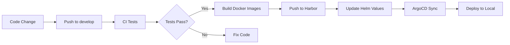
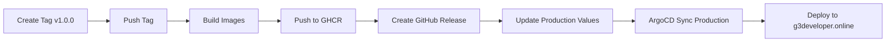

# GitHub Actions - Workflows

Este diretório contém os workflows de CI/CD para o projeto Nexo.

## 📋 Workflows Disponíveis

### 1. CI - Build and Test (`ci.yml`)

**Trigger:** Pull Requests e Push para `develop`

**Funcionalidades:**

- ✅ Testa backend (NestJS)
- ✅ Testa frontend (Next.js)
- ✅ Executa linter
- ✅ Build das aplicações
- ✅ Security scan com Trivy

**Quando executa:**

- Pull requests para `develop` ou `main`
- Push direto na branch `develop`
- Mudanças nos diretórios `apps/**`

---

### 2. Deploy to Local CloudLab (`deploy-local.yml`)

**Trigger:** Push para `develop`

**Funcionalidades:**

- 🔍 Detecta quais apps mudaram
- 🐳 Build de imagens Docker
- 📦 Push para Harbor Registry (harbor.nexo.local)
- 📝 Atualiza Helm values com nova versão
- 🔄 Sincroniza ArgoCD automaticamente

**Requirements:**

- Self-hosted runner configurado no Mac
- Harbor Registry rodando (harbor.nexo.local)
- ArgoCD funcionando (argocd.nexo.local)
- Secrets configurados (ver [SECRETS.md](../SECRETS.md))

**Quando executa:**

- Push na branch `develop`
- Mudanças em `apps/nexo-be/**`, `apps/nexo-fe/**`, `apps/nexo-auth/**`

---

### 3. Release to Production (`release.yml`)

**Trigger:** Criação de tags `v*.*.*`

**Funcionalidades:**

- 🏷️ Cria GitHub Release
- 🐳 Build multi-platform (amd64, arm64)
- 📦 Push para GitHub Container Registry (ghcr.io)
- 📝 Atualiza Helm values de produção
- 🔔 Notifica via Discord

**Como usar:**

```bash
# Criar e publicar uma release
git tag v1.0.0
git push origin v1.0.0
```

**Quando executa:**

- Criação de tags seguindo pattern semver: `v1.0.0`, `v2.1.3`, etc.

---

## 🚀 Setup Inicial

### 1. Configurar Secrets

Veja instruções completas em: [SECRETS.md](../SECRETS.md)

**Secrets obrigatórios:**

```bash
HARBOR_USERNAME
HARBOR_PASSWORD
ARGOCD_AUTH_TOKEN
GITHUB_TOKEN
```

### 2. Configurar Self-Hosted Runner

Para o workflow `deploy-local.yml` funcionar, você precisa configurar um runner:

```bash
# No seu Mac (com Docker e cluster k3d rodando)

# 1. Acessar Settings > Actions > Runners > New self-hosted runner
# 2. Seguir instruções de instalação

# 3. Instalar como serviço
cd ~/actions-runner
./svc.sh install
./svc.sh start

# 4. Verificar status
./svc.sh status
```

**Alternativa com Docker:**

```bash
docker run -d \
  --restart=always \
  --name github-runner \
  -e RUNNER_NAME="nexo-mac-local" \
  -e RUNNER_TOKEN="<TOKEN_DO_GITHUB>" \
  -e RUNNER_REPOSITORY_URL="https://github.com/seu-usuario/nexo" \
  -v /var/run/docker.sock:/var/run/docker.sock \
  myoung34/github-runner:latest
```

### 3. Habilitar Workflows

Os workflows são habilitados automaticamente após o primeiro push.

Para executar manualmente:

1. Vá para **Actions** tab
2. Selecione o workflow
3. Clique em **Run workflow**

---

## 🔄 Fluxo de Trabalho

### Development Flow



### Release Flow



---

## 🔍 Monitoramento

### Ver logs de execução

```bash
# Via GitHub UI
https://github.com/seu-usuario/nexo/actions

# Via GitHub CLI
gh run list
gh run view <run-id>
gh run watch <run-id>
```

### Status badges

Adicione ao README.md:

```markdown


```

---

## 🐛 Troubleshooting

### Workflow não executa

```bash
# Verificar se o workflow está habilitado
# Settings > Actions > General > Actions permissions

# Verificar sintaxe do workflow
act -l  # usando nektos/act para test local
```

### Self-hosted runner offline

```bash
# Verificar status
cd ~/actions-runner
./svc.sh status

# Reiniciar
./svc.sh stop
./svc.sh start

# Ver logs
tail -f _diag/Runner_*.log
```

### Build falha no runner

```bash
# Verificar espaço em disco
df -h

# Limpar Docker cache
docker system prune -af

# Limpar runner cache
rm -rf ~/actions-runner/_work/_tool
```

### ArgoCD sync falha

```bash
# Verificar token
argocd login argocd.nexo.local --insecure --username admin

# Regenerar token
argocd account generate-token --account github-actions

# Atualizar secret no GitHub
# Settings > Secrets > ARGOCD_AUTH_TOKEN
```

---

## 📚 Referências

- [GitHub Actions Documentation](https://docs.github.com/en/actions)
- [Self-hosted Runners](https://docs.github.com/en/actions/hosting-your-own-runners)
- [GitHub Container Registry](https://docs.github.com/en/packages/working-with-a-github-packages-registry/working-with-the-container-registry)
- [ArgoCD CLI](https://argo-cd.readthedocs.io/en/stable/user-guide/commands/argocd/)
- [Harbor Registry](https://goharbor.io/docs/latest/)
